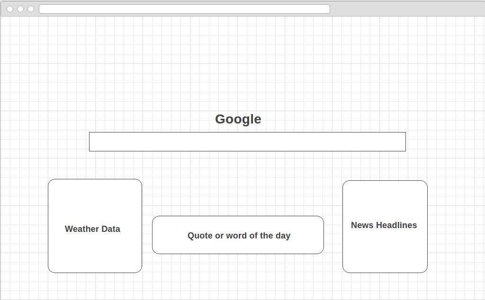

## Google Landing Page

### Background
While minimalist design of Google.com is visually appealing, as someone who uses it as their homepage, I can't help but look at all that whitespace and wonder what else that space could be used for. Having information about the day all in one place will make planning the day easier because rather than having to look at separate resources for something like weather data, the user will have that information all in one place.

### Functionality & MVP
With this extension, users will see on the google homepage:
- [] The local weather data
- [] A word of the day
- [] The top 5 news headlines

### Wireframes

### Technologies and Technilogical Challenges
The extension will be implemented using HTML, CSS, and Javascript along with jQuery for the 3 API calls. I'll split each componenent into separate .js files for clean organization, and then I'll have 1 main.js file that will receive all this data and display it on the page. There will be an html and css file to house and style the data.

The challenges I see:
- Only manipulating Google.com and no other page
- Displaying the data cleanly and attractively on the page
- Having standin messages for content that is loading or not able to be fetched at that time

I'll use the OpenWeatherMap API for the weather data, the Wordnik API for the word of the day, and the NPR API for the news headlines. All these will be called using jQuery's .ajax() method and injected into the existing HTML using jQuery's .append() method on Google's body.

### Implementation Timeline

**Day 1** Get the infrastructure of the extension completed
**Day 2** Inject HTML elements on Google's page only
**Day 3** Get the desired data from the API calls
**Day 4** Display the data on Google's page
**Day 5** Continue displaying data on Google's page
**Day 6** Style data
**Day 7** Style data
